# SSR Analysis — `football-magic-web`

Framework: **Next.js 16.2.7 (App Router)** with **React 19.2.4**, deployed on **Vercel** (per project memory: prod topology is Cloudflare → Vercel). Rendering is App-Router RSC + on-demand ISR. There is no custom server and no `output` override in `next.config.ts` — the platform runtime (Node.js) handles rendering, the Data Cache and the Full Route Cache.

> **Terminology note used throughout:** the page files comment their `generateStaticParams(){ return [] }` as *"on-demand ISR"*. That phrase here means **lazy first-request generation + time-based revalidation** — it is **not** event-driven (tag/path) revalidation. No `revalidateTag`/`revalidatePath`/`unstable_cache`/`'use cache'` exists anywhere in `src` (verified by grep). Every cache in this app is **time-based**.

---

## Phase 1 — Inventory

### How rendering is configured
- `football-magic-web/package.json:6-9` — plain `next dev` / `next build` / `next start`. No static export, no adapter.
- `next.config.ts:1-16` — only configures `images` (`unoptimized: true`, remote patterns). **No** `experimental.ppr`, `cacheComponents`, `output`, or `cacheHandler`. So: default App Router, default Node runtime, standard ISR.
- `tsconfig.json` — path alias `@/* → ./src/*`; nothing rendering-relevant.
- `src/proxy.ts` — **this is the Next 16 middleware.** In Next 16 `middleware.ts` was renamed `proxy.ts` (see `AGENTS.md`: "This is NOT the Next.js you know"). It runs on every matched request before routing.
- `src/instrumentation.ts` — `onRequestError` hook (server error → audit), Node-runtime only.

### SSR-CORE files (the render/data path)
| File | Role | Class |
|---|---|---|
| `src/lib/server-api.ts` | Server data layer: native `fetch` wrapped in React `cache()`, per-getter `next.revalidate`, `UpstreamApiError` vs `null`-miss discipline | SSR-CORE |
| `src/lib/guest-server.ts` | Module-scoped guest-token cache; uses **axios not fetch** on purpose (see Phase 5) | SSR-CORE |
| `src/lib/ssr-auth.ts` | HMAC `X-SSR-Auth` headers so gateway bypasses IP rate-limiting within a monthly quota | SSR-CORE |
| `src/app/layout.tsx` | Root RSC layout; server-fetches sidebar seed (`getTopTeams`/`getTopLeagues`), global metadata, JSON-LD | SSR-CORE |
| `src/store/provider.tsx` | `PersistGate loading={children}` — renders the tree as the fallback so SSR HTML is not blank pre-hydration | SSR-CORE (hydration) |
| `src/app/page.tsx` + `ar/page.tsx` → `components/pages/HomeEntityPage.tsx` | Home / today's matches; `revalidate = 60` | SSR-CORE |
| `src/app/team/[id]/[[...slug]]/page.tsx` (+`ar`) → `components/pages/TeamEntityPage.tsx` | Team page; `revalidate = 3600` | SSR-CORE |
| `src/app/league/[id]/[[...slug]]/page.tsx` (+`ar`) → `components/pages/LeagueEntityPage.tsx` | League page; `revalidate = 3600` | SSR-CORE |
| `src/app/player/[id]/[[...slug]]/page.tsx` (+`ar`) → `components/pages/PlayerEntityPage.tsx` | Player page; `revalidate = 3600` | SSR-CORE |
| `src/app/match/[id]/[[...slug]]/page.tsx` (+`ar`) → `components/pages/MatchEntityPage.tsx` | Match page; `revalidate = 60`; server-renders events + line-ups into HTML | SSR-CORE |
| `src/app/leagues/page.tsx` (+`ar`) → `components/pages/LeaguesEntityPage.tsx` | Leagues browse list; `revalidate = 3600` | SSR-CORE |
| `src/app/country/[code]/layout.tsx` | `generateMetadata` via `getCountry` (page body is client — see incidental) | SSR-CORE (metadata only) |
| `src/app/league/[id]/stats/[category]/layout.tsx` | `generateMetadata` via `getLeague` (page body is client) | SSR-CORE (metadata only) |
| `src/app/sitemap.xml/route.ts` + `src/lib/sitemap.ts` | Sitemap **index** + serialization/collectors; `revalidate = 3600` | SSR-CORE |
| `src/app/{leagues,countries}.xml/route.ts`, `src/app/{teams,players,matches}/[page]/route.ts` | Child sitemaps (revalidate 86400/604800/86400/86400/3600) | SSR-CORE |
| `src/app/robots.ts` | Robots + AI-crawler allowlist + sitemap pointer | SSR-CORE |
| `src/app/og/{home,match,team,league}/[id]/route.tsx` + `src/lib/og.tsx` | `ImageResponse` OG cards; revalidate 86400 (match 300) | SSR-CORE |
| `src/proxy.ts` | Pre-route NFC slug normalization + 301 | SSR-CORE |
| `src/instrumentation.ts` | Server-error audit hook | SSR-CORE |
| `src/lib/normalize.ts` | Response normalizers shared by server + client getters | SSR-CORE |
| `src/lib/schema.ts`, `src/components/seo/JsonLd.tsx`, `SeoSections.tsx` | JSON-LD + server-rendered SEO copy blocks | SSR-CORE |
| `src/lib/seo.ts`, `seo-i18n.ts`, `slug.ts` | Canonical path/hreflang builders, localized SEO strings, NFC slug | SSR-CORE (support) |
| `src/lib/audit.ts` | Server-only fire-and-forget audit POST | SSR-INCIDENTAL |

### SSR-INCIDENTAL (runs at request time but not the rendering purpose)
- `src/app/api/audit/not-found/route.ts` — client-fired 404 logger endpoint.
- `src/lib/audit.ts` — telemetry, swallows all failures.

### Looks like SSR but isn't (client-only despite being reachable server-side)
- **`src/app/country/[code]/page.tsx:1`** — `'use client'`. The page body (tabs, lists) is fetched **in the browser** via `api.*`; only the `layout.tsx` `generateMetadata` runs on the server. **Country pages are in the sitemap** (`src/lib/sitemap.ts:453-470`) yet ship near-empty server HTML — an inconsistency with the entity pages (see Phase 3/5).
- **`src/app/league/[id]/stats/[category]/page.tsx:1`** — `'use client'`; server contributes only metadata. Not in the sitemap, so lower stakes.
- **`src/app/{profile,favorites,settings,notifications,register,delete}/page.tsx`** — `'use client'`, user-specific, `robots: noindex` via their layouts (`favorites/layout.tsx:5`). Correctly *not* SSR content.
- **`src/store/provider.tsx`, `client-layout.tsx`, `lib/layout-context.tsx`, `useSidebarData.ts`, all `*PageClient.tsx`** — client components; they hydrate and drive interactivity but their *initial* markup is produced by the server render of their RSC parents (initialData is passed in).

---

## Phase 2 — Reading order (request → hydration)

1. **`src/proxy.ts`** — *What rewrites/redirects the URL before routing?* NFC slug normalization → 301; `config.matcher` (line 56) excludes api/assets/metadata.
2. **`src/app/layout.tsx`** — *What wraps every page, and what does the server fetch site-wide?* Sidebar seed (`getTopTeams`/`getTopLeagues`, line 51), global `metadata` (line 18), org/website JSON-LD.
3. **`src/store/provider.tsx`** — *Why isn't the SSR HTML blank before hydration?* `PersistGate loading={children}` renders the tree with initial Redux state.
4. **A route entry, e.g. `src/app/team/[id]/[[...slug]]/page.tsx`** — *What's the per-route cache contract?* `revalidate = 3600`, `generateStaticParams(){return []}` (lazy), delegates to the shared entity component.
5. **`src/components/pages/TeamEntityPage.tsx`** — *What actually renders and in what order?* `loadTeam` → `notFound()`/`permanentRedirect()` gates → parallel enrichment (`Promise.all`, line 100) → conditional standings → intro/FAQ/links → JSON-LD → hands `initialData` to `TeamPageClient`.
6. **`src/lib/server-api.ts`** — *How is each fetch cached/deduped and how are misses vs failures handled?* `cache()` (request dedup) + `next.revalidate` (Data Cache) + `serverFetch` (null=404/empty) vs `serverFetchTolerant` (degrade) vs `UpstreamApiError` (fail render, don't poison ISR).
7. **`src/lib/guest-server.ts`** — *Where does auth for those fetches come from?* Module-scoped token, axios-on-purpose, 401→invalidate+retry (called from `server-api.ts:85-88`).
8. **`src/lib/ssr-auth.ts`** — *How does SSR traffic avoid the gateway blocklist?* Rotating HMAC headers, secret server-only.
9. **`src/components/teams/TeamPageClient.tsx`** — *What happens after hydration?* Renders `initialData` immediately; only refetches when `lng` differs from the route locale (line 44-60).
10. **`src/lib/useSidebarData.ts`** — *What refetches client-side and when?* Unscoped English = SSR seed, no fetch (line 34); Arabic/scoped = `/leagues/getSidebar` (backend 5-min cache).
11. **`src/instrumentation.ts`** — *What happens when a render throws?* `onRequestError` → audit `server_error`.

```mermaid
flowchart LR
  A[HTTP request] --> B[proxy.ts NFC 301?]
  B -->|next| C[Route resolution app/...]
  C --> D[RootLayout RSC: sidebar seed + metadata]
  D --> E[Entity page RSC]
  E --> F[server-api.ts fetch]
  F --> G{Data Cache hit?}
  G -->|hit| I[Render RSC + JSON-LD + SEO copy]
  G -->|miss| H[guest-server token -> gateway -> core] --> I
  I --> J{Full Route Cache}
  J -->|fresh| K[Serve cached HTML/RSC]
  J -->|stale| L[SWR: serve stale + regenerate]
  K --> M[Stream to browser]
  L --> M
  M --> N[PersistGate renders tree = SSR HTML]
  N --> O[Hydrate + Redux rehydrate]
  O --> P[Client refetch only if lng != route locale / scoped sidebar]
```



---

## Phase 3 — Why SSR is here (concrete, per-project)

This is an SEO/GEO play over a huge entity graph (memory: ~27k teams, ~440k players, ~1.5M fixtures). SSR exists to put crawlable, localized, factual HTML + structured data on URLs that are otherwise a client-only SPA.

- **Bilingual crawlable content in the HTML, not post-hydration.** `src/store/provider.tsx:17-27` deliberately renders the tree as the `PersistGate` fallback — the comment records that `loading={null}` previously emitted an **empty** body to crawlers. Real benefit; without it every indexable page is blank to a non-JS crawler.
- **Server-rendered factual SEO copy + FAQ + internal links** built from live data: `TeamEntityPage.tsx:119-171` (intro sentences, FAQ items, squad/league/match link lists), `LeagueEntityPage.tsx:84-117`, `MatchEntityPage.tsx:106-154` (per-team goal sentences, events, line-ups into HTML). This is the content crawlers/AI answer engines actually quote.
- **Per-request-correct metadata, canonical, hreflang, JSON-LD.** `generateTeamMetadata` (`TeamEntityPage.tsx:47-76`) emits canonical + `languageAlternates` (en/ar/x-default) + OG/Twitter; JSON-LD via `schema.ts`. `layout.tsx:18-41` sets the site-wide defaults and `metadataBase`.
- **Canonical URL enforcement at render time.** ID-only/wrong-slug URLs `permanentRedirect()` to the slugged canonical (`TeamEntityPage.tsx:95-97`, same in league/match); `proxy.ts` 301s non-NFC Unicode. Consolidates link equity — only meaningful server-side.
- **Fresh live data on the match path.** `getFixture` revalidate 60 (`server-api.ts:171-175`) + match route `revalidate = 60` keep scores near-live in the cached HTML and OG image (`og/match` revalidate 300).
- **Sidebar internal-linking in every page's HTML.** `layout.tsx:48-55` seeds top teams/leagues server-side so those links are always crawlable.
- **Discovery.** `sitemap.xml` index + paginated children (`lib/sitemap.ts`), `robots.ts` (explicit AI-crawler allowlist), all server-generated with real `<lastmod>`.

### What breaks if SSR were removed tomorrow
- **SEO/crawlability & GEO: severe.** Entity pages become blank-shell SPAs; the intro/FAQ/goal-sentence content, JSON-LD, and internal-link mesh vanish from initial HTML. This is the product's whole growth thesis.
- **Social/OG cards: broken.** `/og/*` `ImageResponse` and per-page OG metadata require server rendering.
- **Canonicalization: broken.** No `permanentRedirect`/301 → duplicate ID-only + NFD-slug URLs split ranking.
- **Live-data freshness in shareable HTML: degrades** to client-only (fine for humans, invisible to crawlers).
- **Accessibility with JS disabled:** entity pages would show nothing.

### Benefit paid for but **not** used
- **On-demand/event-driven revalidation: not used at all.** Everything is time-based; a match-event feed or admin publish event could invalidate exactly the affected page but no `revalidateTag`/`revalidatePath` exists.
- **`generateStaticParams` prebuild: intentionally empty** — no build-time static generation (reasonable at this entity scale, but it means every URL pays a first-request cold render).
- **Country & league-stats pages** are `'use client'`, so they pay for a server round-trip (metadata) yet skip the SSR content benefit — country pages are even in the sitemap.

---

## Phase 4 — Should SSR be replaced? (per route)

| Route | Current strategy | Suggested strategy | Why | Effort | Risk |
|---|---|---|---|---|---|
| `/`, `/ar` | ISR `revalidate=60` | **Keep** | Today's fixture list is shared across users and volatile; 60s SWR is the right shared-cache cadence. Client refetches local-tz day. | — | — |
| `/match/[id]` (+ar) | ISR `revalidate=60` | Keep; **add on-demand revalidate** on match-event webhook (optional) | Scores go stale in seconds; 60s is a good blanket, event-driven would tighten live windows without over-rendering dead fixtures. | M (needs feed hook) | Med |
| `/team/[id]` (+ar) | ISR `revalidate=3600` | **Keep** | Squad/venue/founded rarely change; standings only feed SEO text (live table is client-fetched). 1h staleness acceptable. | — | Low |
| `/league/[id]` (+ar) | ISR `revalidate=3600` | **Keep** | Same: server standings feed intro/FAQ text only; interactive table is client-side and fresh. | — | Low |
| `/player/[id]` (+ar) | ISR `revalidate=3600` | Keep (could be **daily**) | Player bios change slowly; 1h is safe, 24h would cut regen churn on 440k pages. | L | Low |
| `/leagues` (+ar) | ISR `revalidate=3600` | **Daily** (`86400`) | League catalogue is near-static; the underlying `getAllLeagues` is already `revalidate=86400`, so the route's 1h is the tighter (wasteful) bound. | L | Low |
| `/country/[code]` | **Client body** + server metadata | **Convert to server RSC + ISR** | It's in the sitemap but ships empty content HTML — SEO gap vs sibling entity pages. | M | Med |
| `/league/[id]/stats/[category]` | Client body + server metadata | Keep, or optional RSC | Not in sitemap; lower SEO stakes. Convert only if these rankings should rank. | M | Low |
| `/profile`,`/favorites`,`/settings`,`/notifications`,`/register`,`/delete` | Client, noindex | **Keep client** | Personalized/auth-gated; correctly excluded from SSR/index. | — | — |
| `/og/*` | ISR `ImageResponse` (86400 / match 300) | **Keep** | Image gen is expensive; caching per-entity is correct. | — | — |
| `sitemap.xml` + children | Route handlers, time-revalidated | **Keep** | Index probes `totalElements`, never loads all rows; graceful fallbacks. Sound. | — | — |

No invented work: the entity ISR routes are well-designed; the only genuine gaps are **country page SSR content** and **absent event-driven invalidation**.

---

## Phase 5 — Runtime cost, caching, best practice

### 5a. What actually runs per request

For an **ISR HIT** (page fresh in the Full Route Cache): **zero app work** — Vercel serves cached HTML/RSC; the render function is not invoked, `server-api.ts` is not called, the guest token is not touched. This is the common case and it's the point of the design.

For an **ISR MISS / stale regeneration** (cold path, first request or after TTL, runs at most once per interval in the background under SWR):

| Route | Repeated per regeneration | Notes / risks |
|---|---|---|
| `/team/[id]` | `getTeamInfo(en)` (page) + `getTeamInfo(ar)` (hreflang alt, `TeamEntityPage.tsx:38-44`) + `Promise.all[getTeamLeagues, getTeamSeasonFixtures, getTeamSquad]` (line 100) + conditional `getLeagueStandings` (sequential, line 107). `generateMetadata` reuses `getTeamInfo` via `cache()`. | **Extra cross-locale `getTeamInfo` per render** purely for the alternate name. `getLeagueStandings` is a serial 5th await after leagues resolve. |
| `/league/[id]` | `getLeague(en)` + `getLeague(ar)` alt + `getLeagueStandings` (serial). | Same cross-locale pattern. |
| `/match/[id]` | `getFixture(en)` + `getFixture(ar)` alt + `Promise.all[events, lineup]` gated on `hasEvents`/`hasLineup` (`MatchEntityPage.tsx:101-104`). | Good gating; parallel enrichment. |
| `/` | `getMatchesByDate(today,0)` (revalidate 60). | Single call; cheap. |
| `/leagues` | `getAllLeagues` (revalidate 86400). | Cheap; route TTL tighter than data TTL (waste). |
| Every route | Root layout `Promise.all[getTopTeams, getTopLeagues]` (revalidate 86400). | Shared across routes via Data Cache; fine. |

**Caching layers in play (with the actual controls):**
1. **React `cache()`** — request-scoped dedup; every getter in `server-api.ts` is wrapped (line 117+). Makes `generateMetadata` + page share one upstream call.
2. **Next Data Cache** — `next: { revalidate }` in `doFetch` (`server-api.ts:55`), default **3600**; per-getter overrides: fixture/events/lineup **60**, matches-by-date **60**, standings/leagues/top-teams/top-leagues/country **86400** (top*) or **3600** (standings default), sitemap slim **86400** (fixtures slim **3600**).
3. **Next Full Route Cache (ISR)** — segment `export const revalidate`: home/match **60**, team/league/player/leagues **3600**, sitemap.xml **3600**, child sitemaps **86400**/**604800**, OG **86400**/**300**.
4. **CDN** — Vercel edge + Cloudflare in front (memory). Serves ISR output; `x-vercel-cache` is the HIT/MISS signal.
5. **Backend Redis** — `/leagues/getSidebar` 5-min (`useSidebarData.ts:19`); core also caches countries/leagues/teams/venues (root CLAUDE.md).
6. **Guest-token module cache** — `guest-server.ts:24-26`, per server instance, `EXPIRY_SKEW_MS=30_000`.
7. **Gateway monthly SSR quota** — `ssr-auth.ts` HMAC bypasses IP rate-limiting; `X-SSR-Call-Id` counts unique calls.
8. **HTTP cache headers** — **none set explicitly** on the XML/OG `Response`s (`sitemap.ts:149-154` sets only `Content-Type`); Next/Vercel derive caching from `revalidate`. No hand-authored `Cache-Control`.

**Expensive-per-request flags:**
- `AbortSignal.timeout(15000)` (`server-api.ts:56`) — a slow upstream can block a regeneration for **up to 15s**. Under SWR users still get stale HTML, but a **cold first request** (no cached version) blocks the visitor for up to 15s. No `stale-if-error` fallback beyond ISR's own last-good copy.
- **Cross-locale `getTeamInfo`/`getLeague`/`getFixture`** for hreflang names — one extra upstream call per entity render, cached only within the render.
- No N+1 in the hot entity pages (enrichment is `Promise.all`). The sitemap **legacy fallbacks** do fan-out (`collectPlayerEntriesLegacy` fetches 25 squads ×2 locales, `sitemap.ts:295-298`) but only when the slim endpoints are down.

### 5b. Best-practice scorecard

| Principle | Verdict | Evidence / consequence |
|---|---|---|
| Render per request only when output differs per request | **PASS** | All indexable routes are ISR-cached and identical for all users; personalization lives in client components (`*PageClient`, `useSidebarData`). No route is force-dynamic. |
| Match cache lifetime to data volatility | **MOSTLY PASS** | Match/home 60s, entities 1h, catalogue-ish data 24h (`server-api.ts`). **Minor FAIL:** `/leagues` route `revalidate=3600` while its only data source is `revalidate=86400` — the route regenerates 24× more often than its data can change (wasted regen, no user benefit). |
| Prefer on-demand/event-driven revalidation when a trigger exists | **FAIL** | Zero `revalidateTag`/`revalidatePath` (grep-verified). A finished match still waits out the 60s timer; a squad transfer waits 1h. Consequence: unnecessary regen of millions of rarely-changing pages **and** avoidable staleness on the few that just changed. A match-event feed / admin publish event would be the natural trigger and doesn't exist. |
| Time-based + stale-while-revalidate for predictable-cadence data | **PASS** | ISR is SWR by default; `UpstreamApiError` (`server-api.ts:68-101`) ensures a transient failure serves the last good copy instead of baking a 404. |
| Push personalization out of the cached shell | **PASS** | Auth/language/favorites are client-side (`TeamPageClient.tsx:44-60` refetches only on `lng` change); cached HTML is user-agnostic English (or Arabic on `/ar`). |
| Never let a slow third-party API sit uncached on the render path | **PARTIAL PASS** | Upstream is cached via Data Cache + ISR and time-bounded (15s). **But** the 15s ceiling is long for a cold first render, and there's no explicit per-call fallback beyond ISR last-good. Enrichment getters degrade to empty (`serverFetchTolerant`) which is good. |
| Stream/defer slow non-critical sections | **PARTIAL** | No `<Suspense>` streaming boundaries around slow enrichment; instead slow bits (interactive tabs, sidebar) are pushed to client components — achieves the goal differently. Match events/line-ups are awaited into HTML (intentional, for SEO). |
| Keep serialized payload small | **PASS (watch)** | `initialData` passed to `*PageClient` is a single normalized entity, not raw upstream. Match page also serializes events + lineup arrays; bounded but the largest payload. |
| Cache key includes every output-changing input | **PASS** | Locale is in the **path** (`/` vs `/ar`), not a header — so the Full Route Cache key (pathname) already separates languages. `lng` header only varies the Data Cache via distinct getter args. Season/slug are in the path. No known key collision. |
| Explicit invalidation story | **FAIL** | Only implicit TTL expiry. No documented/coded way to bust a specific page on a content event. Any data fix propagates only after the timer. |

### 5c. Direct answer

**For this project, blanket render-on-every-request would be wrong, and the app already avoids it** — everything indexable is ISR-cached and shared. The remaining question is *how* each bucket regenerates.

**Bucket (1) — genuinely time-sensitive, keep short-interval ISR (never fully static, never per-request):**
- `/`, `/ar` (60s) and `/match/[id]` (+ar) (60s). Live scores/today's list. *These are correct as-is;* the only upgrade is optional event-driven revalidation for live matches.

**Bucket (2) — should regenerate on content change / on a timer (currently timer-only):**
- `/team`, `/league`, `/player` (+ar). Correct as ISR; the improvement is **adding an event trigger** (transfer, final whistle, table update) so the 1h timer becomes a safety net rather than the only mechanism. Player could drop to daily.
- `/country/[code]` — should additionally **become server-rendered** (it's currently client-body).

**Bucket (3) — effectively static, lengthen the timer:**
- `/leagues` (+ar) — league catalogue. Move route `revalidate` to daily to match its data.
- Child sitemaps for leagues/countries (already 86400/604800) — fine.

**Before / after (controls that change this) — do NOT apply:**

```diff
// src/app/leagues/page.tsx  (route regenerates 24x more than its data can change)
- export const revalidate = 3600;
+ export const revalidate = 86400;   // matches getAllLeagues' own 86400 Data Cache TTL

// src/app/player/[id]/[[...slug]]/page.tsx  (+ ar)  — 440k slow-moving pages
- export const revalidate = 3600;
+ export const revalidate = 86400;   // daily is ample for player bios; cuts regen churn
```

Event-driven revalidation would require infrastructure that **does not exist yet**:
```diff
// (new) src/app/api/revalidate/route.ts — authenticated webhook from core/engine
+ import { revalidatePath } from 'next/cache';
+ export async function POST(req: Request) {
+   // verify shared secret (reuse SSR_SHARED_SECRET / gateway HMAC scheme)
+   const { type, id, homeSlug, awaySlug } = await req.json();
+   if (type === 'match') { revalidatePath(`/match/${id}/${homeSlug}-vs-${awaySlug}`); revalidatePath(`/ar/match/${id}/...`); }
+   // team transfer -> revalidatePath(`/team/${id}/...`), etc.
+   return Response.json({ ok: true });
+ }
```
Trigger sources that would need wiring: **match-event feed / engine scheduled task** → whistle & goal events for match pages; **admin action** in `11-magicians-engine` → team/league edits; no publish-event bus exists in `football-magic-web` today. Until then, timers are the only mechanism and the current values are reasonable.

**Trade-off honesty:** the accepted staleness windows are — live scores in shareable HTML up to **60s** (acceptable for SEO; humans see fresh client-side data via the interactive tabs), entity SEO copy up to **1h** (fine — names/venues/standings-text don't move fast), league catalogue up to **1h today / 24h recommended** (fine). The one genuinely arguable window is a **finished match's final score sitting 60s stale in the cached OG card / crawlable HTML** — for football that's borderline, and it's the strongest case for the optional match-event webhook.

### 5d. Verification (confirm behavior yourself)

- **HIT vs MISS:** `curl -sI https://<host>/team/541/real-madrid` → inspect **`x-vercel-cache`**: `HIT` (served from Full Route Cache), `STALE`/`REVALIDATED` (SWR regen happening), `MISS`/`PRERENDER` (cold generation). Per project memory, also check this before trusting a 404 — a stale cache can serve an old outcome until the next deploy.
- **Dynamic vs cached:** after `next build`, the build output legend marks each route ○ (static) / ● (SSG) / ƒ (dynamic) / ISR with its revalidate. Entity routes should show ISR with the expected interval; `country`/`stats` show their layout metadata as dynamic-ish. `.next/server/app/**/*.html` + `*.meta` show what was prerendered.
- **Data Cache behavior:** two rapid requests to a cold entity page should yield one upstream call (React `cache()` dedup within a render) and subsequent requests within the TTL should not hit the gateway (watch the audit/gateway logs for `X-SSR-Call-Id` counts).
- **Revalidation cadence:** request a match page, note a score/`<lastmod>`, wait >60s, request again → the regenerated copy should update; team page should not change within the hour.
- **Locale key separation:** confirm `/team/541/...` returns `lang="en"` HTML and `/ar/team/541/...` returns Arabic body — proves path-based cache keys don't collide.
- **Timeout/fallback:** temporarily point `NEXT_PUBLIC_API_URL` at a black-hole to observe the 15s `AbortSignal` ceiling and that ISR serves the last-good copy (not a 500) for already-cached pages.

---

## Open questions (not determinable from code alone)

1. **Deploy target confirmation.** ISR + `revalidate` assume Vercel/Node with a persistent Full Route Cache. Confirmed only via project memory (Cloudflare → Vercel), not from repo config — a self-hosted `next start` without shared cache storage would change the cost model.
2. **Does Cloudflare add its own cache layer** in front of Vercel for these routes, and with what TTL? Not visible in-repo; could double-cache or mask `x-vercel-cache`.
3. **Are the backend slim sitemap endpoints deployed?** The collectors fall back to legacy fan-out getters if not (`sitemap.ts`); which path is live in prod affects sitemap regen cost.
4. **Live-match cadence expectations.** Is 60s acceptable for finished-score freshness in crawlable HTML/OG, or is a match-event webhook actually wanted? Product decision, not in code.
5. **`generateStaticParams` staying empty at scale** — is there an intent to prebuild top entities at build time, or is lazy-first-request permanent? Comment says prebuild nothing.
6. **`SSR_SHARED_SECRET` presence in the Vercel env.** Per memory this was a prior outage cause; `ssr-auth.ts` degrades to `{}` (no signature) if unset, silently reintroducing gateway rate-limit exposure. Not verifiable from code.
7. **Whether Cloudflare/Vercel strip or honor the absence of explicit `Cache-Control`** on the XML/OG responses.
